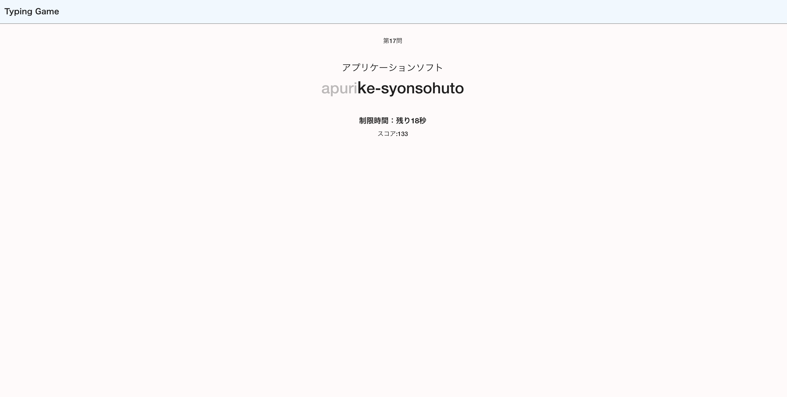

# タイピングゲーム
https://typinggame-53161.web.app

## このアプリを開発した理由
タイピングが苦手で、タイピングゲームにはよくお世話になったので 
自分でも作ってみたいと思い開発をしました。 

## 開発において工夫したこと
ゲーム開始前に3秒のカウントダウンしたり、時間制限後すぐ結果を表示するのではなく、終了！の文字を出したりと、自然な流れで違和感なくゲームを開始、終了するように意識しました。

## 使用技術
フロントエンド: TypeScript, Vue.js, Vuetify 
バックエンド: Firebase(Firestore Database) 
本番環境: Firebase(Hosting)

## 機能
* タイピングゲーム(ITモード, 筋肉モード, 世界の偉人モード)
* ランキング表示(名前, モード, スコア, ランク)